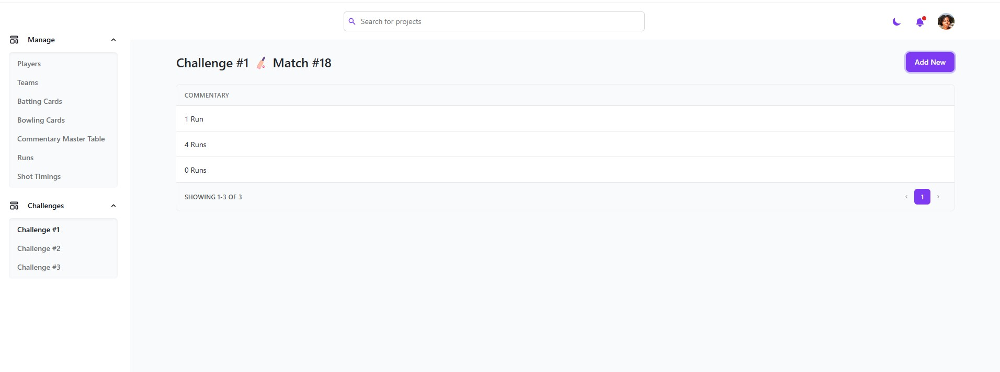

# 🚀 Introduction

The project is lightly architected using microservices(not entirely though) with a separate service for authentication, tournament service (backend) for all application logic and frontend application for user interface. The tech stack used in NodeJS with Express JS for backend sevices (auth and tournament) and ReactJS for frontend application.
The database used is MongooseDB.

### `Setting up the Project`

The project can be set up using the source code supplied. Please do as the below.

- Install docker compose.
- Create .env files for user-service, tournament-service and frontend-app and copy the contents of env.example files in them.
- Run the project with docker compose. Command is mentioned in further sections.
- Restore the db dump provided in **db_dump** folder
- Run the frontend application with npm commands

All of the above steps are covered below.

### `1. Using Docker Compose`

Go to the root directory of the project and run the below commands.

```
docker compose up
```
This will run the backend services (auth service and tournament-service)

### `2. Restoring Database Dump`

Download and unzip the db backup provided in **db_dump** folder and restore to mongodb using the below command. This will restore master data required for tournament service.

```
mongorestore --uri="mongodb://localhost:27017/tournamentdb" "C:\Users\User\Downloads\your folder path"
```
You can download mongodb tools using the link below
- [Mongo Tools](https://www.mongodb.com/try/download/relational-migrator) - Mongo Restore Tools.


### `3. Running frontend application`

Go to the frontend directory and run the below command to access the application. This service is not dockertized.

```
npm run dev
```


### `4. The Application`

Once the project is successfully up and running please create an account in the application using register functionality. Once done you can log in to the application.
Once in the application you can go ahead and check the challenges. If in case of any concerns please do not hesitate to contact us. 



<sub>🤫 Happy Cricketing.</sub>

